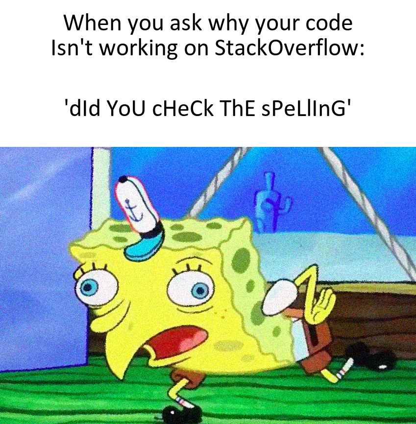

# Good Morning, Good Evening or Hello!

Welcome to my Github showroom of my work For **Assignment One**!

## The purpose of this page

I have created this page to showcase my work for **Assignment one** which will include:
1. The meme itself
2. The code that I produced that resulted in the meme's creation
3. My reasons / inpirations as to why I created this specific meme
4. How this is an original adaptation from the original 

### The meme:

This meme was created using `R`, but also included using the [{Magick}](https://cran.r-project.org/web/packages/magick/vignettes/intro.html) package

*A very robust and powerfull package that most `R` users should utilise!!*



### Inspiration that lead to the creation of this *meme*

* I wanted something that was original *enough*, but also had some truth behind it
* I knew that the *derpy* spongebob image would be great to use, especially in reference with the text, as most people always point out the obvious, which in fairness, sometimes can be the issue, however, most of the time is not. 
* A reference to the meme I adapted mine from can be found [here](https://en.meming.world/images/en/thumb/7/7d/Mocking_SpongeBob_meme_4.jpg/240px-Mocking_SpongeBob_meme_4.jpg)


### The code produced to create this **EPIC** meme

```r
# reading the URL for the meme picture
spongebob_meme <- image_read("https://cdn.vox-cdn.com/thumbor/zB0qRIm9McyX9OHiou4YT0kLPQE=/
                             0x0:650x381/1200x800/filters:focal(273x139:377x243)/
                             cdn.vox-cdn.com/uploads/chorus_image/image/62893956/
                             mocking_spongebob.0.jpg") %>% 
  image_scale(500) %>% 
  image_oilpaint() %>% 
  image_noise() #adding some funny {magick} features

# creating the first annotation
annotation_1 <- image_blank(width = 500,
                  height = 90,
                  color = "#FFFFFF") %>%
  image_annotate(text = "When you ask why your code\nIsn't working on StackOverflow:",
                 color = "#000000",
                 size = 30,
                 font = "calibri",
                 gravity = "center")

# creating the second annotation
annotation_2 <- image_blank(width = 500,
                            height = 90,
                            color = "#FFFFFF") %>% 
  image_annotate(text = "'dId YoU cHeCk ThE sPeLlInG'",
                 color = "#000000",
                 size = 30,
                 font = "calibri",
                 gravity = "center")

# joining the two annotations together
annotations <- c(annotation_1, annotation_2) %>% 
  image_append(stack = TRUE)

# joining the annotations to the initial image
meme <- c(annotations, spongebob_meme) %>% 
  image_append(stack = TRUE)

# calling the "meme" image to print
meme
```
*left out the line where it writes the meme to disk*

## How my adaptation is different to the original:

In the original meme, there is either no text, or both of the texts are the same, with the bottom line mimicing the top line in the uppercase, lowercase format. However in My adaptation, instead of mimicing the above line, I added a reference to what most people comment when others are asking for help regarding their code. I also added `image_oilpaint()` and `image_oilnoise()` for a little extra spicyness ;)
